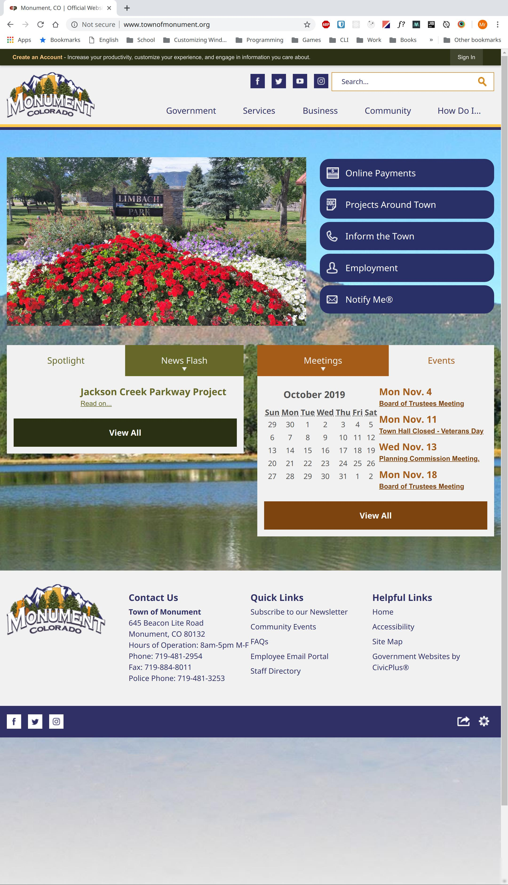
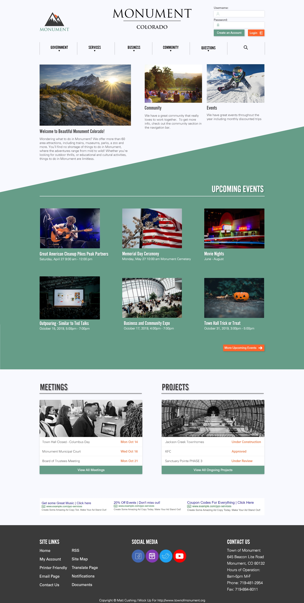
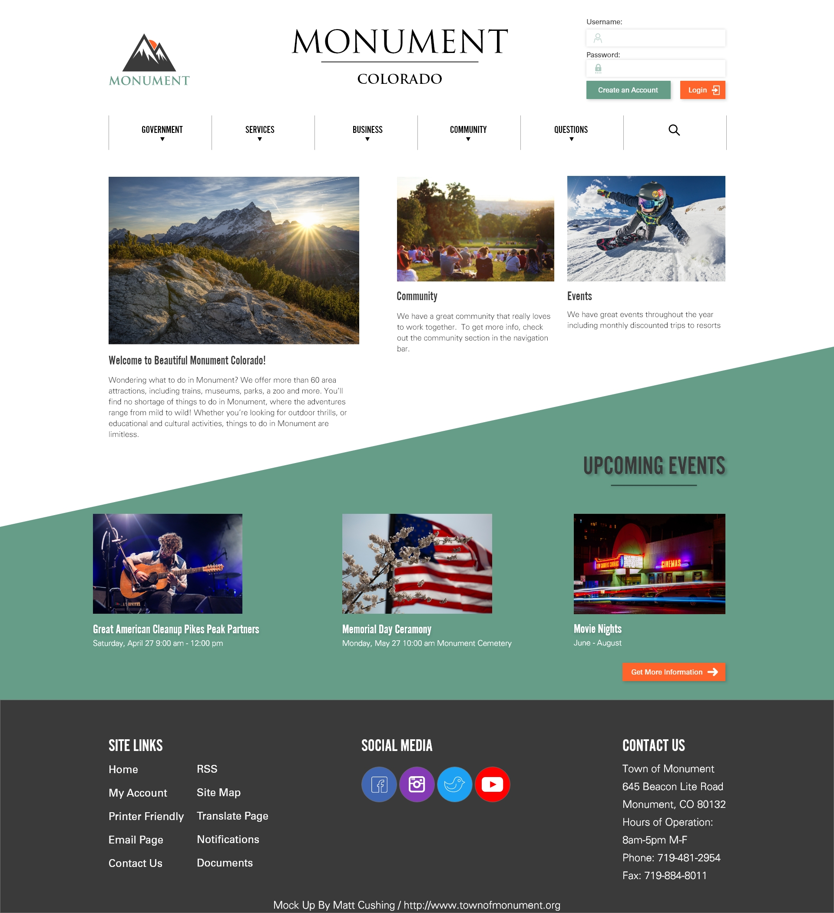

# Monument Website Redesign

This work was done for my 5 1/2 week Web Design II class at Colorado Technical University

Requirements:
 - Can only use HTML and CSS
 - Pick a local website that needs a redesign
    - Make your own logo in Adobe Illustrator
    - The only thing you can use on the site is some of the text to fill up some of the content
    - The only pictures you may take are the ads

Assignments:
 - Create a mock up using Adobe Illustrator, Photoshop, or another product from the Adobe suite of the landing page and receive critique from the professor and classmates
 - Re-factor your mock up with the critique from your professor and classmates in mind
 - Write up the HTML for the landing page
 - Write the CSS for the landing page

Will add to this "Read Me" and the website as the class goes on.

Live Site via Netlify: https://friendly-ptolemy-b607cc.netlify.com/

---

Below are static images of the original site and the current re-design:

### Original

---

### Revised Mock Up

---

### Original Mock Up
